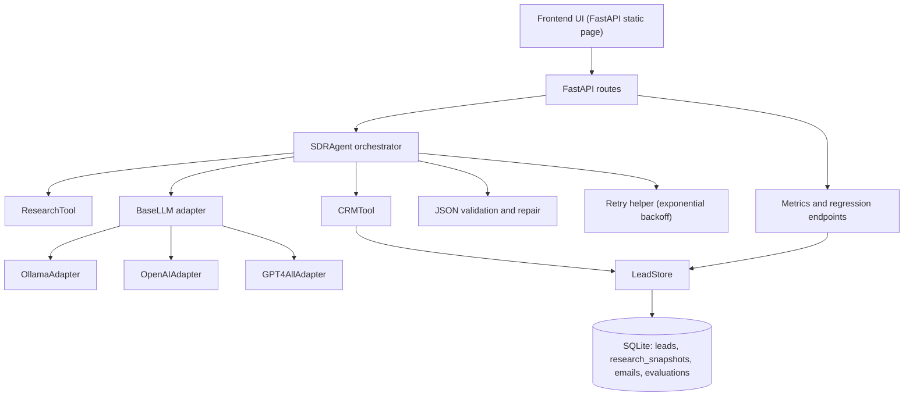

# SDRAgent

Deterministic async FastAPI SDR agent that:
- takes a company domain
- researches company context
- drafts and refines an outbound email
- evaluates output quality
- persists CRM-style records in SQLite

## 5-Minute Setup

### Recommended: Docker

```bash
git clone <your-repo-url>
cd SDRAgent
cp .env.example .env
docker compose --profile ollama up --build
```

Notes:
- First time `ollama` run can take a few minutes (model download).
- OpenAI mode: set `OPENAI_API_KEY` in `.env`, then run `docker compose --profile openai up --build`.
- GPT4All mode: run `docker compose --profile gpt4all up --build`.

### Local (uv)

```bash
git clone <your-repo-url>
cd SDRAgent
uv sync
cp .env.example .env
uv run uvicorn app.main:app --reload
```

## Frontend:
- UI: `http://127.0.0.1:8000/`
- API docs: `http://127.0.0.1:8000/docs`

## Architecture

Agent flow:

`research -> generate -> reflect -> evaluate -> persist`



## Quick Codebase Map:
- `app/agent`: orchestration logic
- `app/tools`: explicit tool boundaries
- `app/llm`: provider adapters + factory
- `app/db`: persistence and SQL
- `app/api`: HTTP contracts + handlers
- `app/static`: minimal frontend
- `tests`: mock-backed E2E smoke test

## Provider Configuration

Default in `.env.example`: `LLM_PROVIDER=ollama`

Supported providers:
- `ollama`
  - `OLLAMA_MODEL_NAME`
  - `OLLAMA_BASE_URL`
- `openai`
  - `OPENAI_API_KEY`
  - `OPENAI_MODEL_NAME`
  - `OPENAI_BASE_URL`
- `gpt4all`
  - `GPT4ALL_MODEL_NAME`
  - `GPT4ALL_MODEL_PATH`
- `mock` (tests/dev only)
  - set `ALLOW_MOCK_LLM=true`

## Run Tests

```bash
uv run pytest -q
```

The E2E test uses `mock`, so it does not require external model services.

## API Endpoints

- `POST /run-agent`
  - runs one full agent execution for a domain
- `GET /metrics`
  - 7-day aggregate eval count and overall average
- `GET /metrics/dimensions-trend?days=14`
  - per-dimension 7-day averages + daily trend points
- `GET /crm/recent?limit=15`
  - compact recent CRM records
- `GET /crm/full?limit=500`
  - full CRM rows for detailed table view
- `GET /eval-regression?threshold_drop=0.5`
  - recent-vs-baseline regression status

## Design Notes

- Orchestration: raw async agent flow for clarity and debuggability.
- Non-determinism handling: strict JSON contracts, repair retries, bounded reflection loop.
- Deliberate tradeoff: minimal built-in UI instead of separate frontend framework to maximize shipping speed while preserving end-to-end usability.
