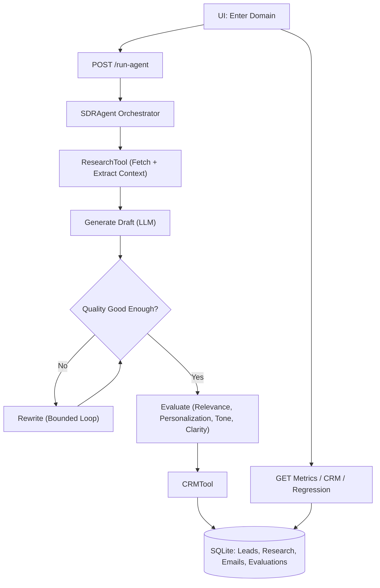

# SDRAgent

Python SDR agent that:
- accepts a company domain
- researches public company context
- drafts and refines outbound email copy
- evaluates quality dimensions
- persists CRM-style records in SQLite

Includes a minimal FastAPI UI and API for runs, CRM history, and score trends.

## Requirements

- Python `>=3.11` (Docker image uses Python `3.13`)
- `uv` for local dependency/runtime commands
- Docker + Docker Compose v2 (only for containerized setup)

Provider-specific requirements:
- `ollama` (default): running Ollama service + pulled model (for Docker profile, this is automated)
- `openai`: valid `OPENAI_API_KEY`
- `gpt4all`: local model file and path configured
- `mock`: set `LLM_PROVIDER=mock` and `ALLOW_MOCK_LLM=true` (tests/dev only)

## Quick Start

### Option A: Docker (recommended)

First run downloads an Ollama model and may take a few minutes.

```bash
git clone <your-repo-url>
cd SDRAgent
cp .env.example .env
docker compose --profile ollama up --build
```

After containers are healthy, open the UI:
- `http://127.0.0.1:8000/`

Other provider profiles:
- OpenAI: set `OPENAI_API_KEY` in `.env`, then run `docker compose --profile openai up --build`
- GPT4All: run `docker compose --profile gpt4all up --build`

### Option B: Local (uv)

```bash
git clone <your-repo-url>
cd SDRAgent
cp .env.example .env
uv sync
uv run uvicorn app.main:app --reload
```

App endpoints:
- UI: `http://127.0.0.1:8000/`
- OpenAPI docs: `http://127.0.0.1:8000/docs`

## Configuration

Default provider in `.env.example`: `LLM_PROVIDER=ollama`

Main env vars by provider:
- `ollama`: `OLLAMA_MODEL_NAME`, `OLLAMA_BASE_URL`, `OLLAMA_TIMEOUT_SECONDS`
- `openai`: `OPENAI_API_KEY`, `OPENAI_MODEL_NAME`, `OPENAI_BASE_URL`, `OPENAI_TIMEOUT_SECONDS`
- `gpt4all`: `GPT4ALL_MODEL_NAME`, `GPT4ALL_MODEL_PATH`, `GPT4ALL_MAX_TOKENS`
- `mock`: `ALLOW_MOCK_LLM=true`

Cross-cutting:
- `SDR_AGENT_DB_PATH` (SQLite path)
- `MAX_REFLECTION_ROUNDS`

## Tests

```bash
uv run pytest -q
```

The E2E test uses `mock` and does not require external model services.

## API Endpoints

- `POST /run-agent` - run one full agent execution for a domain
- `GET /metrics` - 7-day aggregate eval count and overall average
- `GET /metrics/dimensions-trend?days=14` - per-dimension rolling averages + daily points
- `GET /crm/recent?limit=15` - compact recent CRM rows
- `GET /crm/full?limit=500` - full CRM rows
- `GET /eval-regression?threshold_drop=0.5` - recent-vs-baseline regression status

## Architecture

Flow: `input domain -> research -> generate -> reflect/rewrite -> evaluate -> persist`


```mermaid
flowchart TD
    U["UI: Enter Domain"] --> R["POST /run-agent"]
    R --> A["SDRAgent Orchestrator"]
    A --> T1["ResearchTool (Fetch + Extract Context)"]
    T1 --> G["Generate Draft (LLM)"]
    G --> Q{"Quality Good Enough?"}
    Q -->|No| W["Rewrite (Bounded Loop)"]
    W --> Q
    Q -->|Yes| E["Evaluate (Relevance, Personalization, Tone, Clarity)"]
    E --> T2["CRMTool"]
    T2 --> DB[("SQLite: Leads, Research, Emails, Evaluations")]
    U --> V["GET Metrics / CRM / Regression"]
    V --> DB
```

Code map:
- `app/agent`: orchestration
- `app/tools`: research extraction, prompts, CRM tool
- `app/llm`: provider adapters + factory
- `app/db`: schema + queries
- `app/api`: request/response models + routes
- `app/static`: frontend
- `tests`: E2E + tool-level tests
